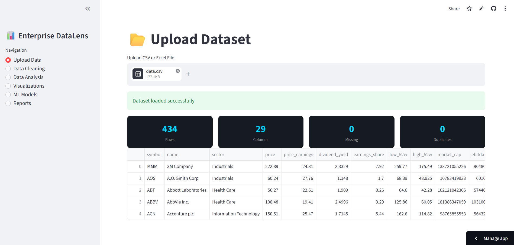
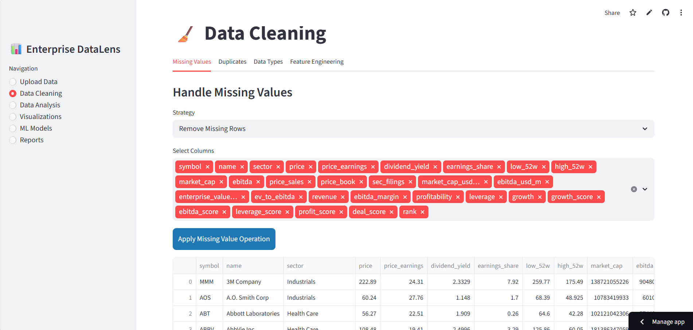
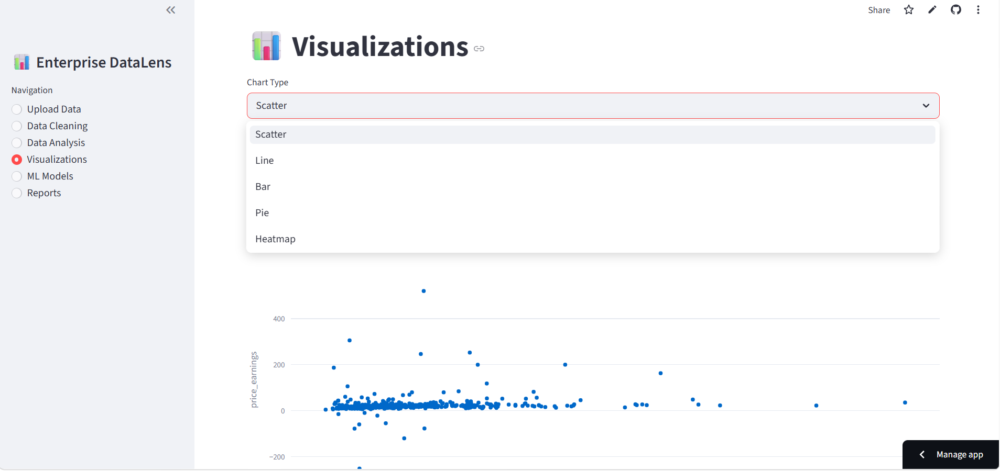
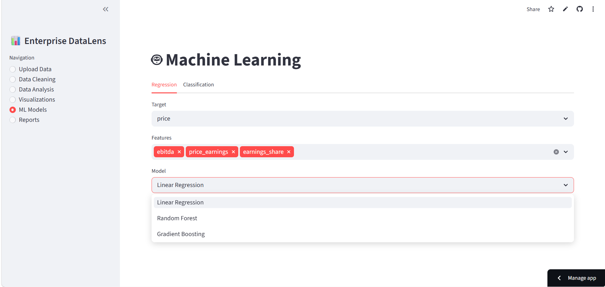
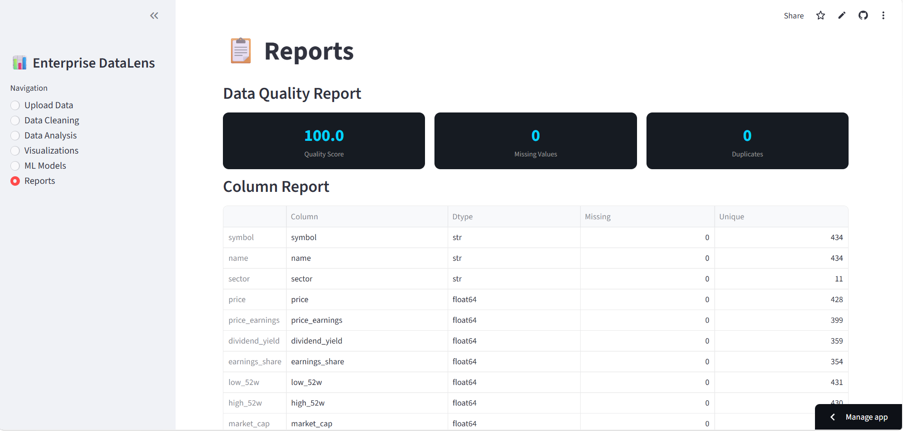

# Enterprise DataLens Pro

Enterprise DataLens Pro is a production-ready Data Analysis and Machine Learning platform built using Streamlit and Python. The application provides an end-to-end analytics workflow, enabling users to upload datasets, clean and preprocess data, perform exploratory data analysis, create interactive visualizations, build machine learning models, and generate reports — all within a unified web interface.

---

# Project Overview

Enterprise DataLens Pro is designed to simplify the complete data science lifecycle through an interactive and enterprise-style dashboard.

The platform combines:

* Data ingestion
* Data preprocessing
* Exploratory Data Analysis (EDA)
* Interactive visualization
* Machine learning workflows
* Automated reporting

The application is implemented as a single-file Streamlit application:

```bash
app1.py
```

---

# Features

## 1. Upload Data

Supports uploading:

* CSV files
* Excel files (.xlsx, .xls)

### Data Health Metrics

After upload, the platform automatically displays:

* Number of rows
* Number of columns
* Missing values count
* Duplicate records count

---

## 2. Data Cleaning

The platform provides comprehensive preprocessing utilities:

### Missing Value Handling

Users can fill missing values using:

* Mean
* Median
* Mode
* Custom values

### Additional Cleaning Features

* Duplicate removal
* Data type conversion
* Feature engineering support
* Column transformation utilities

---

## 3. Data Analysis

Automated exploratory data analysis features include:

* Descriptive statistics
* Data distribution analysis
* Histograms
* Boxplots
* Correlation insights

---

## 4. Interactive Visualizations

Create interactive charts and dashboards using Plotly.

### Supported Charts

* Scatter plots
* Line charts
* Bar charts
* Pie charts
* Heatmaps

---

## 5. Machine Learning Models

The platform supports both regression and classification workflows.

### Regression Models

* Linear Regression
* Random Forest Regressor
* Gradient Boosting Regressor

### Regression Evaluation Metrics

* R² Score
* MAE (Mean Absolute Error)
* RMSE (Root Mean Squared Error)

### Classification Models

* Random Forest Classifier

### Classification Evaluation

* Accuracy score
* Confusion matrix
* Classification report

---

## 6. Reports

Generate analytical summaries and downloadable datasets.

### Reporting Features

* Data Quality Score
* Processed dataset download
* Data summary insights

---

# Screenshots

## Upload Dataset Page



---

## Data Cleaning Page



---

## Visualization Dashboard



---

## Machine Learning Models



---

## Reports Dashboard



---

# Technical Architecture

## Session Management

The application uses:

```python
st.session_state
```

This enables persistent dataset handling and activity tracking across multiple pages.

---

## Logging System

A dedicated logging system tracks:

* User activity
* Errors and exceptions
* Application events

### Log File

```bash
datalens.log
```

---

## Performance Optimization

Efficient dataset loading is implemented using:

```python
st.cache_data
```

This improves performance and reduces redundant processing.

---

## UI/UX Design

The application includes:

* Custom CSS styling
* Enterprise dashboard layout
* Dark mode aesthetic
* Interactive navigation sidebar
* Responsive design principles

---

# Tech Stack

## Frontend & UI

* Streamlit
* Plotly

## Data Processing

* Pandas
* NumPy

## Machine Learning & Statistics

* Scikit-learn
* SciPy

---

# Project Structure

```bash
Enterprise-DataLens-Pro/
│
├── app1.py
├── requirements.txt
├── README.md
├── datalens.log
└── assets/
```

---

# Installation

## Clone the Repository

```bash
git clone https://github.com/your-username/enterprise-datalens-pro.git
cd enterprise-datalens-pro
```

---

## Install Dependencies

```bash
pip install -r requirements.txt
```

---

# Run the Application

Execute the following command:

```bash
streamlit run app1.py
```

The application will open in your browser automatically.

---

# Example Workflow

1. Upload a CSV or Excel dataset
2. Clean missing or duplicate data
3. Analyze distributions and statistics
4. Create visualizations
5. Train ML models
6. Evaluate model performance
7. Generate reports and download processed data

---

# Screenshots

## Upload Dataset Page

* CSV and Excel upload support
* Data quality overview
* Enterprise dashboard UI

## Data Cleaning Page

* Missing value handling
* Duplicate removal
* Feature engineering

## Visualization Dashboard

* Interactive Plotly charts
* Business intelligence insights

---

# Resume Project Description

## Enterprise DataLens Pro — Data Analytics & Machine Learning Platform

Developed a production-ready analytics platform using Python and Streamlit to support end-to-end data science workflows including data ingestion, preprocessing, exploratory analysis, visualization, machine learning, and reporting. Integrated interactive dashboards, automated evaluation metrics, session management, logging systems, and enterprise-style UI components to streamline analytical operations.

---

# Key Skills Demonstrated

* Data Analysis
* Data Cleaning
* Exploratory Data Analysis (EDA)
* Data Visualization
* Machine Learning
* Dashboard Development
* Python Programming
* Streamlit Development
* Statistical Analysis
* Feature Engineering
* Model Evaluation
* Enterprise UI Design

---

# Future Enhancements

Potential improvements for future versions:

* User authentication system
* SQL database integration
* Advanced ML pipelines
* Real-time analytics
* PDF report generation
* Cloud deployment
* Multi-user collaboration
* API integration
* Automated feature selection
* Deep learning support

---

# Deployment

The application can be deployed using:

* Streamlit Community Cloud
* Render
* Railway
* AWS
* Azure
* Google Cloud Platform

---

# License

This project is licensed under the MIT License.

---

# Author

Developed by Haradev Dagur

Data Analyst | Python (Data Analysis) | Machine Learning Enthusiast

## Contact

- LinkedIn: https://www.linkedin.com/in/haradev-dagur-924760394/
- Email: hardevdagur03@gmail.com
